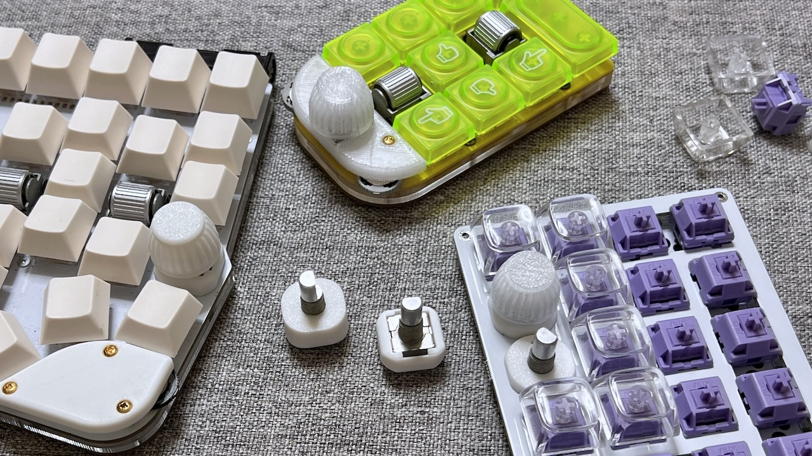
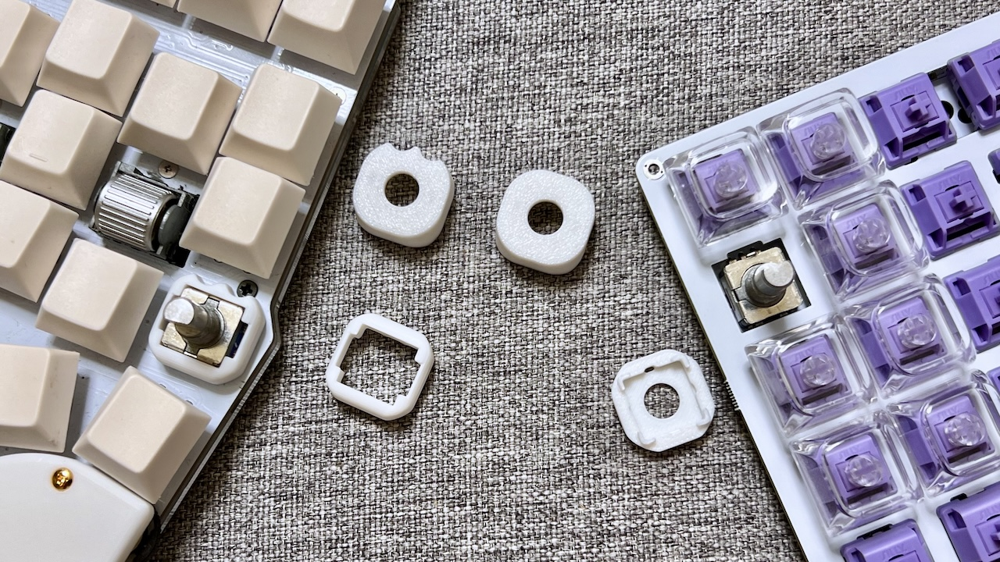

# EC11 Rotary Encoder Knob and Cover

|File Name|Description|
|-|-|
|Cover - Medium.stp||
|Cover - Tall.stp||
|Cover - Switch plate.stp|Compatible with holes for keyswitches|
|Cover - Medium for Handyman.stp|There is a screw-avoidance notch for the [Handyman マクロパッド](https://github.com/Taro-Hayashi/Handyman/blob/main/README_EN.md)|
|Cover - Tall for Handyman.stp|There is a screw-avoidance notch for the [Handyman マクロパッド](https://github.com/Taro-Hayashi/Handyman/blob/main/README_EN.md)|
|19mm knob.stp||
|20mm knob.stp||
|Rotary encoder knob and cover 0.4mm.3mf|Reference settings|
|Rotary encoder knob and cover 0.2mm.3mf||

> [!NOTE]
> The cover only confirmed this or the same type EC11.
> https://www.aliexpress.com/item/1005003532687682.html

<a property="dct:title" rel="cc:attributionURL" href="https://github.com/Taro-Hayashi/Keyboard-3D/">EC11 Rotary Encoder Knob and Cover</a> by <a rel="cc:attributionURL dct:creator" property="cc:attributionName" href="https://x.com/w_vwbw">Taro Hayashi</a> is licensed under <a href="https://creativecommons.org/licenses/by/4.0/?ref=chooser-v1" target="_blank" rel="license noopener noreferrer" style="display:inline-block;">CC BY 4.0</a>

