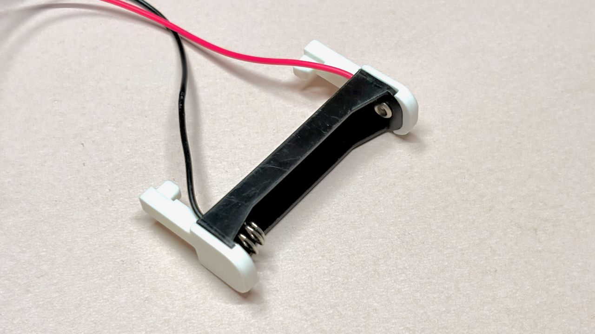
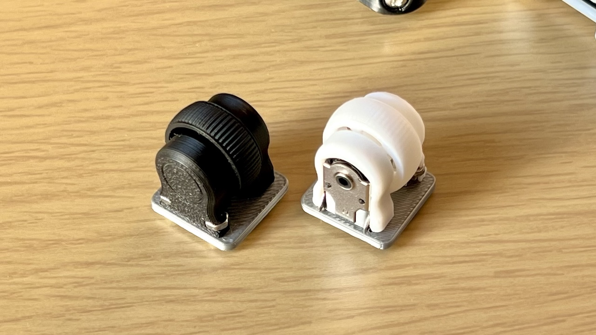
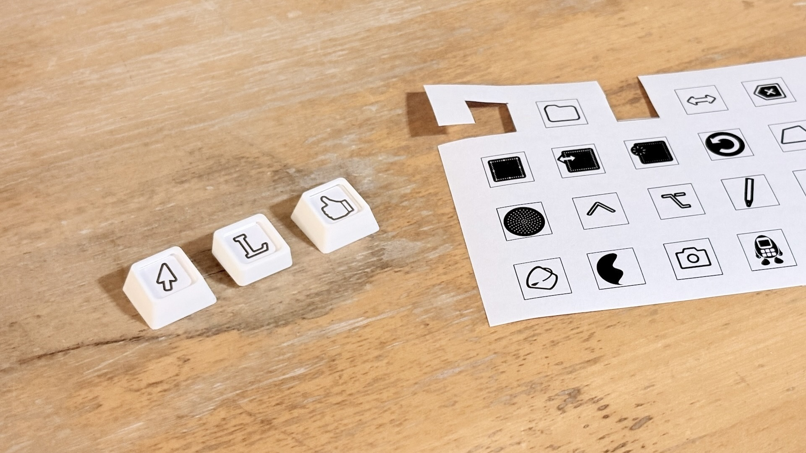
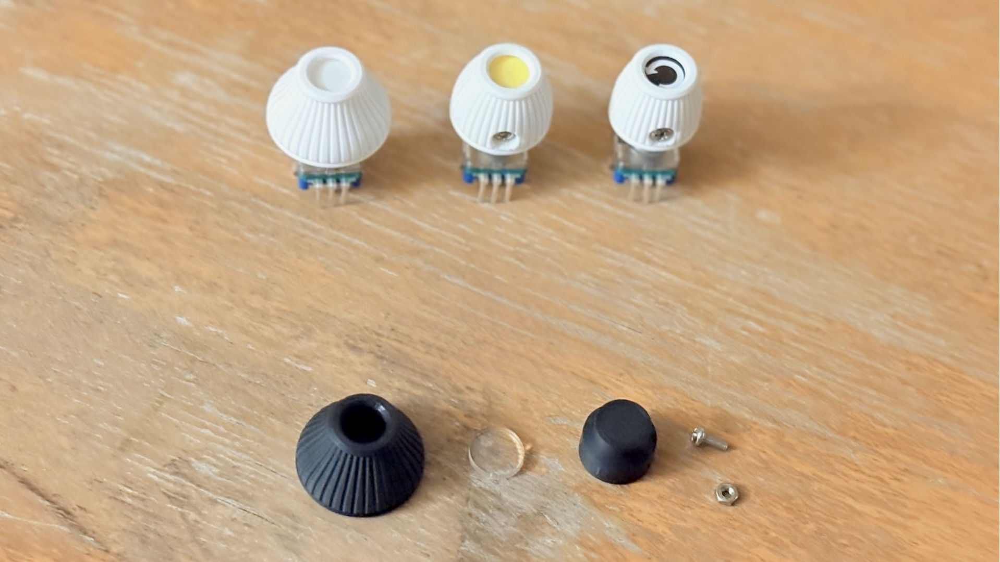
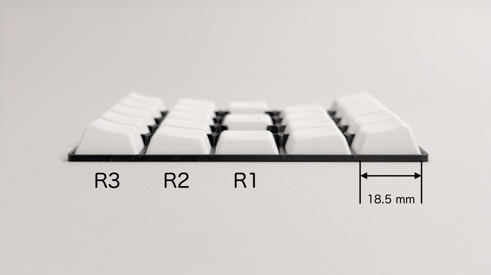
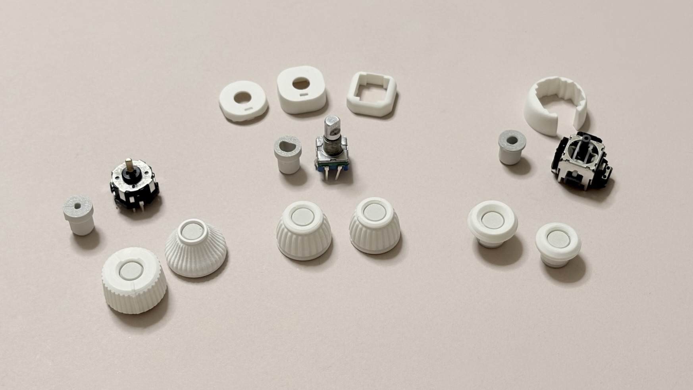
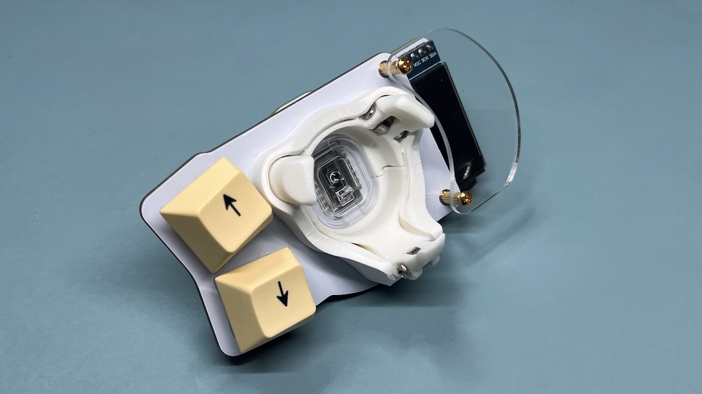
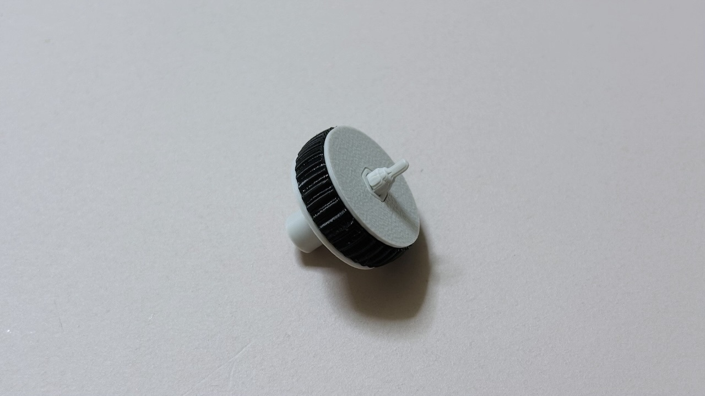

# Keyboard-3D

## Battery Box adaptor

- GitHub [/BatteryBoxAdaptor](https://github.com/Taro-Hayashi/Keyboard-3D/tree/main/BatteryBoxAdaptor)

Battery Box  
https://akizukidenshi.com/catalog/g/g109292/  
https://akizukidenshi.com/catalog/g/g103046/

<a property="dct:title" rel="cc:attributionURL" href="https://github.com/Taro-Hayashi/Keyboard-3D/tree/main/BatteryBoxAdaptor">Battery Box adaptor</a> by <a rel="cc:attributionURL dct:creator" property="cc:attributionName" href="https://x.com/w_vwbw">Taro Hayashi</a> is licensed under <a href="https://creativecommons.org/publicdomain/zero/1.0/?ref=chooser-v1" target="_blank" rel="license noopener noreferrer" style="display:inline-block;">CC0 1.0</a>

## 1U Wheel Encoder THQWGD001
- Maker World https://makerworld.com/en/models/550355
- GitHub https://github.com/Taro-Hayashi/THQWGD001

<a property="dct:title" rel="cc:attributionURL" href="https://github.com/Taro-Hayashi/THQWGD001">1U Wheel Encoder THQWGD001</a> by <a rel="cc:attributionURL dct:creator" property="cc:attributionName" href="https://x.com/w_vwbw">Taro Hayashi</a> is licensed under <a href="https://creativecommons.org/licenses/by/4.0/?ref=chooser-v1" target="_blank" rel="license noopener noreferrer" style="display:inline-block;">CC BY 4.0</a>

## Skylight Keycaps

- Maker World https://makerworld.com/en/models/2022020
- GitHub [/SkylightKeycaps](https://github.com/Taro-Hayashi/Keyboard-3D/tree/main/SkylightKeycaps)

<a property="dct:title" rel="cc:attributionURL" href="https://github.com/Taro-Hayashi/Keyboard-3D/tree/main/SkylightKeycaps">Skylight Keycaps</a> by <a rel="cc:attributionURL dct:creator" property="cc:attributionName" href="https://x.com/w_vwbw">Taro Hayashi</a> is licensed under <a href="https://creativecommons.org/licenses/by/4.0/?ref=chooser-v1" target="_blank" rel="license noopener noreferrer" style="display:inline-block;">CC BY 4.0</a>

## Skylight Knob

- Maker World https://makerworld.com/en/models/2022020
- GitHub [/SkylightKnob](https://github.com/Taro-Hayashi/Keyboard-3D/tree/main/SkylightKnob)

<a property="dct:title" rel="cc:attributionURL" href="https://github.com/Taro-Hayashi/Keyboard-3D/tree/main/SkylightKnob">Skylight Knob</a> by <a rel="cc:attributionURL dct:creator" property="cc:attributionName" href="https://x.com/w_vwbw">Taro Hayashi</a> is licensed under <a href="https://creativecommons.org/licenses/by/4.0/?ref=chooser-v1" target="_blank" rel="license noopener noreferrer" style="display:inline-block;">CC BY 4.0</a>

## CSC Keycaps

- Maker World https://makerworld.com/en/models/1706644
- GitHub [/CSCKeycaps](https://github.com/Taro-Hayashi/Keyboard-3D/tree/main/CSCKeycaps)

<a property="dct:title" rel="cc:attributionURL" href="https://github.com/Taro-Hayashi/Keyboard-3D/tree/main/CSCKeycaps">CSC Keycaps</a> by <a rel="cc:attributionURL dct:creator" property="cc:attributionName" href="https://x.com/w_vwbw">Taro Hayashi</a> is licensed under <a href="https://creativecommons.org/licenses/by/4.0/?ref=chooser-v1" target="_blank" rel="license noopener noreferrer" style="display:inline-block;">CC BY 4.0</a>

## Basic Rotary Encoder Knobs and Joystick cap

- Maker World https://makerworld.com/en/models/813137
- GitHub [/EncoderAndJoystickCover](https://github.com/Taro-Hayashi/Keyboard-3D/tree/main/EncoderAndJoystickCover)

RKJXT1F42001, EC11, Joystick

<a property="dct:title" rel="cc:attributionURL" href="https://github.com/Taro-Hayashi/Keyboard-3D/tree/main/EncoderAndJoystickCover">Basic Rotary Encoder Knobs and Joystick cap</a> by <a rel="cc:attributionURL dct:creator" property="cc:attributionName" href="https://x.com/w_vwbw">Taro Hayashi</a> is licensed under <a href="https://creativecommons.org/licenses/by/4.0/?ref=chooser-v1" target="_blank" rel="license noopener noreferrer" style="display:inline-block;">CC BY 4.0</a>

## Trackball Case

- GitHub [/TrackballCase](https://github.com/Taro-Hayashi/Keyboard-3D/tree/main/TrackballCase)

Optimized for [Killer Whale](https://github.com/Taro-Hayashi/KillerWhale/blob/main/README_EN.md)

<a property="dct:title" rel="cc:attributionURL" href="https://github.com/Taro-Hayashi/Keyboard-3D/tree/main/TrackballCase">Trackball Case</a> by <a rel="cc:attributionURL dct:creator" property="cc:attributionName" href="https://x.com/w_vwbw">Taro Hayashi</a> is licensed under <a href="https://creativecommons.org/licenses/by/4.0/?ref=chooser-v1" target="_blank" rel="license noopener noreferrer" style="display:inline-block;">CC BY 4.0</a>

## Mouse Wheel

- Maker World https://makerworld.com/en/models/550322
- GitHub [/MouseWheel](https://github.com/Taro-Hayashi/Keyboard-3D/tree/main/MouseWheel)

Optimized for [Killer Whale](https://github.com/Taro-Hayashi/KillerWhale/blob/main/README_EN.md)

<a property="dct:title" rel="cc:attributionURL" href="https://github.com/Taro-Hayashi/Keyboard-3D/tree/main/MouseWheel">Mouse Wheel</a> by <a rel="cc:attributionURL dct:creator" property="cc:attributionName" href="https://x.com/w_vwbw">Taro Hayashi</a> is licensed under <a href="https://creativecommons.org/licenses/by/4.0/?ref=chooser-v1" target="_blank" rel="license noopener noreferrer" style="display:inline-block;">CC BY 4.0</a>

