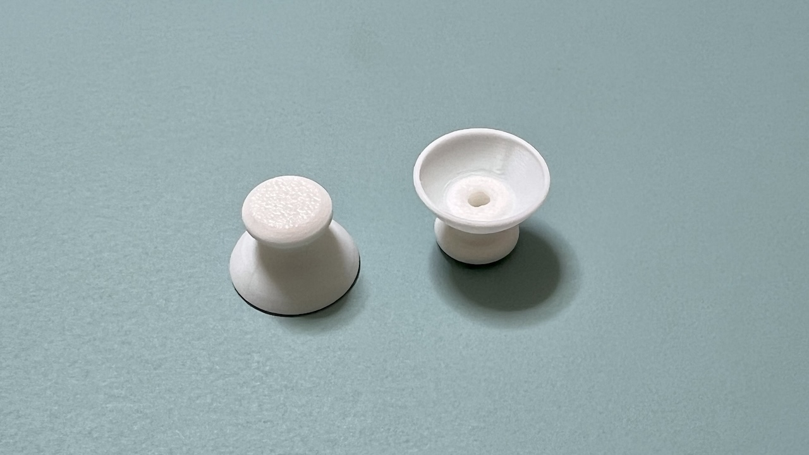

# Model for keyboard

## EC11 Rotary Encoder Knob and Cover

- Maker World https://makerworld.com/en/models/813137
- Printables https://www.printables.com/model/1083443-ec11-rotary-encoder-knob-and-cover
- GitHub https://github.com/Taro-Hayashi/Keyboard-3D/tree/main/EC11Cover

<a property="dct:title" rel="cc:attributionURL" href="https://github.com/Taro-Hayashi/Keyboard-3D/">EC11 Rotary Encoder Knob and Cover</a> by <a rel="cc:attributionURL dct:creator" property="cc:attributionName" href="https://x.com/w_vwbw">Taro Hayashi</a> is licensed under <a href="https://creativecommons.org/licenses/by/4.0/?ref=chooser-v1" target="_blank" rel="license noopener noreferrer" style="display:inline-block;">CC BY 4.0</a>

## Joystick Cap

- Maker World https://makerworld.com/en/models/813127
- Printables https://www.printables.com/model/1083436-joystick-cap
- GitHub https://github.com/Taro-Hayashi/Keyboard-3D/tree/main/JoystickCap

<a property="dct:title" rel="cc:attributionURL" href="https://github.com/Taro-Hayashi/Keyboard-3D/">Joystick Cap</a> by <a rel="cc:attributionURL dct:creator" property="cc:attributionName" href="https://x.com/w_vwbw">Taro Hayashi</a> is licensed under <a href="https://creativecommons.org/licenses/by/4.0/?ref=chooser-v1" target="_blank" rel="license noopener noreferrer" style="display:inline-block;">CC BY 4.0</a>

## Mouse Wheel
- Maker World https://makerworld.com/en/models/550322
- Printables https://www.printables.com/model/949831-mouse-wheel
- GitHub https://github.com/Taro-Hayashi/Keyboard-3D/tree/main/MouseWheel

<a property="dct:title" rel="cc:attributionURL" href="https://github.com/Taro-Hayashi/Keyboard-3D/">Mouse Wheel</a> by <a rel="cc:attributionURL dct:creator" property="cc:attributionName" href="https://x.com/w_vwbw">Taro Hayashi</a> is licensed under <a href="https://creativecommons.org/licenses/by/4.0/?ref=chooser-v1" target="_blank" rel="license noopener noreferrer" style="display:inline-block;">CC BY 4.0</a>

## 1U Wheel Encoder THQWGD001
- Maker World https://makerworld.com/en/models/550355
- Printables https://www.printables.com/model/949835-1u-wheel-encoder-thqwgd001
- GitHub https://github.com/Taro-Hayashi/THQWGD001

<a property="dct:title" rel="cc:attributionURL" href="https://github.com/Taro-Hayashi/THQWGD001">THQWGD001</a> by <a rel="cc:attributionURL dct:creator" property="cc:attributionName" href="https://x.com/w_vwbw">Taro Hayashi</a> is licensed under <a href="https://creativecommons.org/licenses/by/4.0/?ref=chooser-v1" target="_blank" rel="license noopener noreferrer" style="display:inline-block;">CC BY 4.0</a>

### Others
Non-keyboard models can be found here
- https://github.com/Taro-Hayashi/Keyboard-3D
